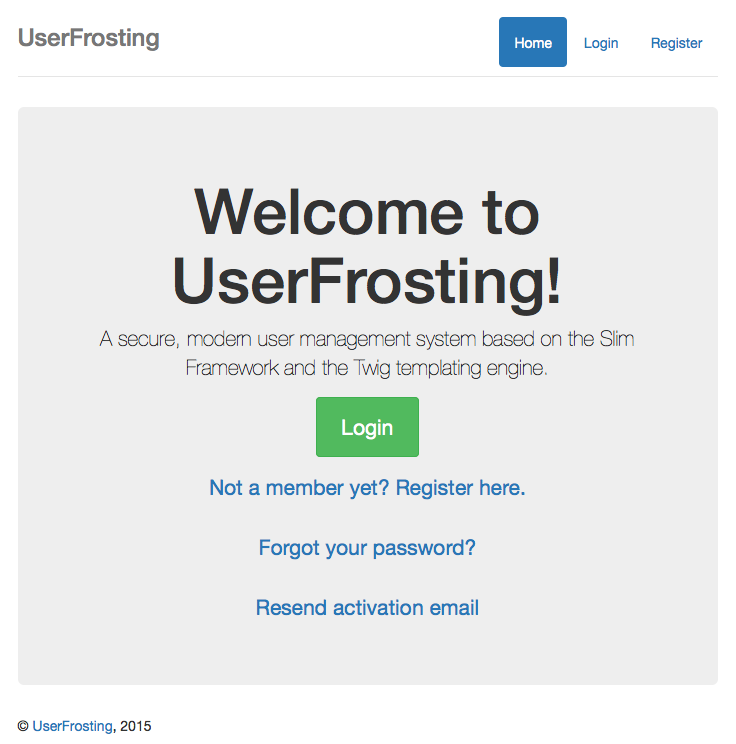
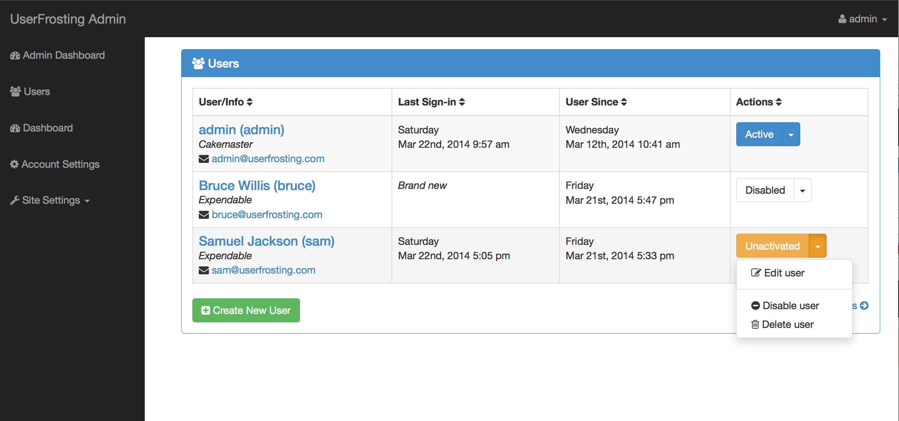
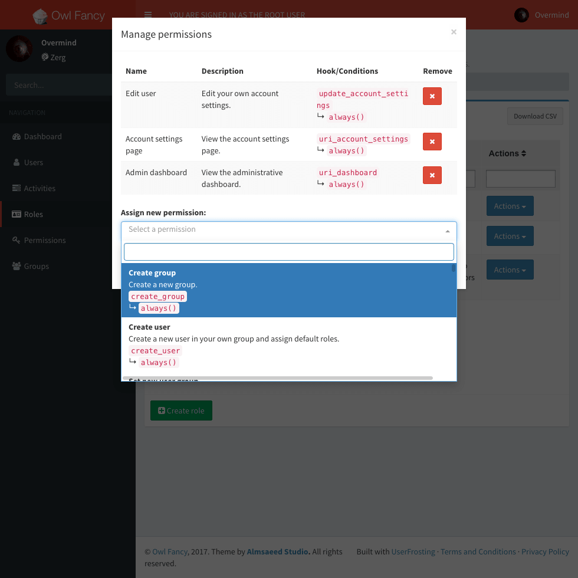

# UserFrosting 4.1

[https://www.userfrosting.com](https://www.userfrosting.com)

If you simply want to show that you like this project, or want to remember it for later, you should **star**, not **fork**, this repository.  Forking is only for when you are ready to create your own copy of the code to work on.

## By [Alex Weissman](https://alexanderweissman.com)

Copyright (c) 2017, free to use in personal and commercial software as per the [license](LICENSE.md).

UserFrosting is a secure, modern user management system written in PHP and built on top of the [Slim Microframework](http://www.slimframework.com/), [Twig](http://twig.sensiolabs.org/) templating engine, and [Eloquent](https://laravel.com/docs/5.4/eloquent#introduction) ORM.

## Features

### User login screen

### User management page

### Permissions management page

## [Demo](https://demo.userfrosting.com)

## Installation

Please see our [installation guide](https://learn.userfrosting.com/installation).

## Troubleshooting

If you are having trouble installing UserFrosting, please [join us in chat](https://chat.userfrosting.com) or try our [forums](https://forums.userfrosting.com).

If you are generally confused about the structure and layout of the code, or it doesn't look like the kind of PHP code that you're used to, please [start from the beginning](https://learn.userfrosting.com/background).  

## Mission Objectives

UserFrosting seeks to balance modern programming principles, like DRY and MVC, with a shallow learning curve for new developers.  Our goals are to:

- Create a fully-functioning user management script that can be set up in just a few minutes
- Make it easy for users to quickly adapt the code for their needs
- Introduce novice developers to best practices such as separation of concerns and DRY programming
- Introduce novice developers to modern constructs such as front-end controllers, RESTful URLs, namespacing, and object-oriented modeling
- Build on existing, widely used server- and client-side components
- Clean, consistent, and well-documented code

## Documentation

### [Learning UserFrosting](https://learn.userfrosting.com)

### [API documentation](http://api.userfrosting.com)

### [Change log](CHANGELOG.md)

## Running tests

Run `php bakery test` from the root project directory. Any tests included in `sprinkles/*/tests` will be run.

## About the Developers

### Alexander Weissman

Alex is the founder and co-owner of two companies, one that does [math tutoring at Indiana University](https://bloomingtontutors.com) in Bloomington, IN and another company that does [math tutoring at UMD](https://collegeparktutors.com) in College Park, MD. He is a PhD student in the School of Informatics and Computing at Indiana University.

### Louis Charette

Louis's a civil engineer in Montréal, Québec who also has a passion for coding. He is one of the main contributors for SimpsonsCity.com and likes to share his knowledge by helping others the same way he was helped when he first started coding.

### Jordan Mele

Jordan's a developer at Mayvin Training and a student studying Computer Science at the University of Wollongong. His passion is creating software-based solutions to overcomplicated problems, without taking control away from the user. He's also Australian.

### Sarah Baghdadi

Sarah is UserFrosting's UX specialist and frontend designer.  In addition to her work on the UF application itself, she is responsible for the amazing design of https://www.userfrosting.com and https://learn.userfrosting.com.

### Mike Jacobs

Mike's a programmer and IT specialist for a small business in New Hampshire, and works on open source projects when he's not camping or traveling.

### Srinivas Nukala

Srinivas's a web applications architect, with a passion for open source technologies. He is experienced in building SaaS (software as a service) web applications and enjoys working on open source projects and contributing to the community. He has a Masters in Computer Science from Pune University, India.

## Thanks to our translators!

- Louis Charette (@lcharette) - French
- Karuhut Komol (@popiazaza) - Thai
- Pietro Marangon (@Pe46dro) - Italian
- Abdullah Seba (@abdullahseba) - Arabic
- Bruno Silva (@brunomnsilva) - Portuguese
- @BruceGui - Chinese
- @kevinrombach - German
- @rafa31gz - Spanish
- @splitt3r - German
- @X-Anonymous-Y - German
- Dmitriy (@rendername) - Russian
- Amin Akbari (@aminakbari) - Farsi

## Contributing

Please see our [contributing guidelines](.github/CONTRIBUTING.md) as well as our [style guidelines](STYLE-GUIDE.md).
