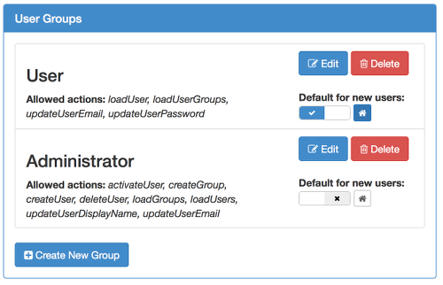

---
layout: default
title: "UserFrosting: Components"
--- 
# Components

<div class="header-menu">
  <nav class="navbar navbar-default" role="navigation">
    <div class="container-fluid">
      <!-- Brand and toggle get grouped for better mobile display -->
      <div class="navbar-header">
        <button type="button" class="navbar-toggle" data-toggle="collapse">
          <span class="sr-only">Toggle navigation</span>
          <span class="icon-bar"></span>
          <span class="icon-bar"></span>
          <span class="icon-bar"></span>
        </button>
      </div>
      <!-- Collect the nav links, forms, and other content for toggling -->
      <div class="collapse navbar-collapse">
        <ul class="nav navbar-nav">
          <li><a href="#users">Users</a></li>
          <li><a href="#groups">Groups</a></li>
          <li><a href="#pages">Account Pages</a></li>
          <li><a href="#actions">Secure Actions</a></li>
        </ul>
      </div><!-- /.navbar-collapse -->
    </div><!-- /.container-fluid -->
  </nav>
</div>

## <a name="users"></a><i class='fa fa-user'></i> Users


UserFrosting is all about, well, **users**.  Specifically, it's for situations when you want users of your site to have an account on your site and be able to log in with a username (or email address) and password.  This is known as **authentication**.

You may also want your users to be able to manage their account information (such as changing their email address, password, or other information), or register a new account for themselves when they visit your site.  You may also want to control what individual users will see when they log into your site, and what types of things they can or cannot do when logged in.  This last concept is often referred to as **authorization**.

User accounts can be created in two ways: by another user who is authorized to create user accounts (such as site administrators), or directly through self-registration from the "registration" page.  This second method can be enabled or disabled by administrators through the "site settings" page.  Self-registered users can also be required to activate their account through an email link.  If this feature is enabled (through the "email activation" button in site settings), newly registered users will be emailed a link containing a unique **activation token**.  The user must then click this link before they will be able to log in.

Accounts can also be manually activated by administrators.  For more details on account registration and activation, see the "Account Registration" page.

Administrators can also **edit** user details, temporarily **disable** user accounts from the "users" page, or **delete** a user account entirely.  For more information, see the <a href="features.html#user-management">User Management</a> section.

There is one special account, called the **root account**.  The root account is the first account created during the installation process (see "Installation").  It is defined as the account with `user_id` of `1`, although this can be changed in `models/config.php`.  The root account cannot be deleted, and is automatically granted permission for every action and page (see <a href="features.html#authorization">Authorization</a>).

## <a name="groups"></a><i class='fa fa-users'></i> Groups



**Groups** are used to control authorization for multiple users at once, as well as customize the appearance and layout of the pages that each user sees.  Each user can belong to one or more groups, but only one group will be considered the user's **primary group**.  The primary group is used to determine which page the user will land on when they log in, as well as the formatting for their side menu bar.  Primary group assignment can also be used as a criteria for authorization: for example, you may authorize a group of site moderators to disable user accounts, but only for users whose primary group is "User".  For more details, see the <a href="features.html#authorization">Authorization</a> section.

Groups can be managed from the "Groups" page under "Site Settings".  Here, one may edit group names, and set the landing page for primary members of that group.  Additionally, groups can be set as **default groups**.  Self-registered users are automatically added to the default groups when they create their account.  One default group can also be set as the **default primary group**.  Self-registered users will have their primary group set to this default group.

Groups can be authorized to perform certain actions or access certain pages.  Users automatically gain all the permissions associated with all groups to which they belong.  UserFrosting uses a default-deny authorization scheme, which means that users can only be denied access to an action or page by being omitted from groups that have that access.  For more information, see the <a href="components.html#authorization">Authorization</a> section.

## <a name="pages"></a><i class='fa fa-files-o'></i> Account Pages

**Account pages** make up the navigable content of your site.  Each page is implemented as a `.php` file, and can contain PHP, HTML, and Javascript.  We recommend that you separate your visible content (HTML) from the PHP as much as possible as a best practice.  This can be done by using Javascript/AJAX to mediate interaction between your account pages and a set of backend **api pages**.  For more information on this, see the section <a href="features.html#api">Backend API</a>.

The default installation comes with the following pages:

* `account_settings.php`: The page where users can change their email address and password.
* `dashboard.php`: A sample dashboard page for users.  Doesn't do anything currently, but could be used to display messages, a feed, or other high-importance information.
* `dashboard_admin.php`: A sample dashboard page for administrators.  Doesn't do anything currently, but could be used to display site statistics, monitor user activity, or manage other activities.
* `groups.php`: The page where administrators can manage groups.  Allows admins to create, edit, and delete groups, set default and default primary groups.
* `header.php`: Not a navigable page.  Renders the appropriate menu bars for users, usually loaded from other pages via jQuery, for example:

```
$('.navbar').load('header.php', function() {
    $('.navitem-dashboard').addClass('active');
});
```

* `includes.php`: Not a navigable page.  Loads core jQuery, bootstrap, and UserFrosting javascript modules.  Also, applies appropriate CSS styles for users.
* `index.php`: The first page that users are sent to upon login.  Automatically redirects users to their home page.
* `logout.php`: Logs the current user out.  We may move this to the `api` directory soon.
* `site_authorization.php`: The page where administrators can manage user, group, and page authorization.  See <a href="features.html#authorization">Authorization</a> for more information.
* `site_settings.php`: The page where administrators can change settings for the site, including site name, enable or disable account registration, email login, and more.
* `user_details.php`: The page where administrators can view and edit details for a user, including group membership.  Takes the GET parameter `id`, where `id` is the id of the user to be displayed. 
* `users.php`: The page where administrators can view a list of all users, edit their account information, activate, disable, and delete accounts.

These are located in the `account` subdirectory.  You can manually add additional subdirectories in `models/config.php` by adding the path to the `$page_include_paths` array.

## <a name="actions"></a><i class='fa fa-lock'></i> Secure Actions

Like UserCake, the first version of UserFrosting was only able to control access at the page level.  Each group either had or didn't have access to a particular page.  When I started implementing the tutor management system for [my company](http://bloomingtontutors.com), I quickly realized that I needed to be able to allow different users access to different resources on the same page.  Furthermore, I realized that I needed a user's authorization to depend on certain contexts.  For example, I wanted to allow tutors to edit a student's details, but only if they had been assigned to that student.  Of course, this could be implemented with something like:

```
if (hasStudent($loggedInUser->user_id, $student_id)){
  updateUser($student_id, ...);
}
```

But I didn't want to hard code these rules throughout my site, and then have to manually update each one if I wanted to change permission rules.  I needed a solution that allowed contextual access control, with all of the rules kept in one place.

Enter the concept of **secure actions**.  Secure actions are functions that perform some atomic operation, such as modifying a user, assigning a user to a group, or viewing a list of users.  They are special because, when they are called, they first check to see if the user who called them is authorized to perform that action with the specified parameters.  This is achieved through PHP's reflective programming API, which allows a running to script to "know thyself."  A secure action calls the `checkActionPermissionSelf` function, which looks up the name of the function in the database to see if the current user (or their groups) is authorized to call it.  If so, the parameters supplied to the function are checked against one or more **permits**.  Permits are functions that check if supplied parameters meet certain criteria, and then return a true/false value.  For example, the permit `isLoggedInUser(user_id)` checks to see whether the supplied `user_id` matches the `user_id` of the currently logged in user.  If (and only if) the user passes all of the required permits for that action, then the secure function proceeds to execute.

For more information, see the <a href="features.html#authorization">Authorization</a> section.
