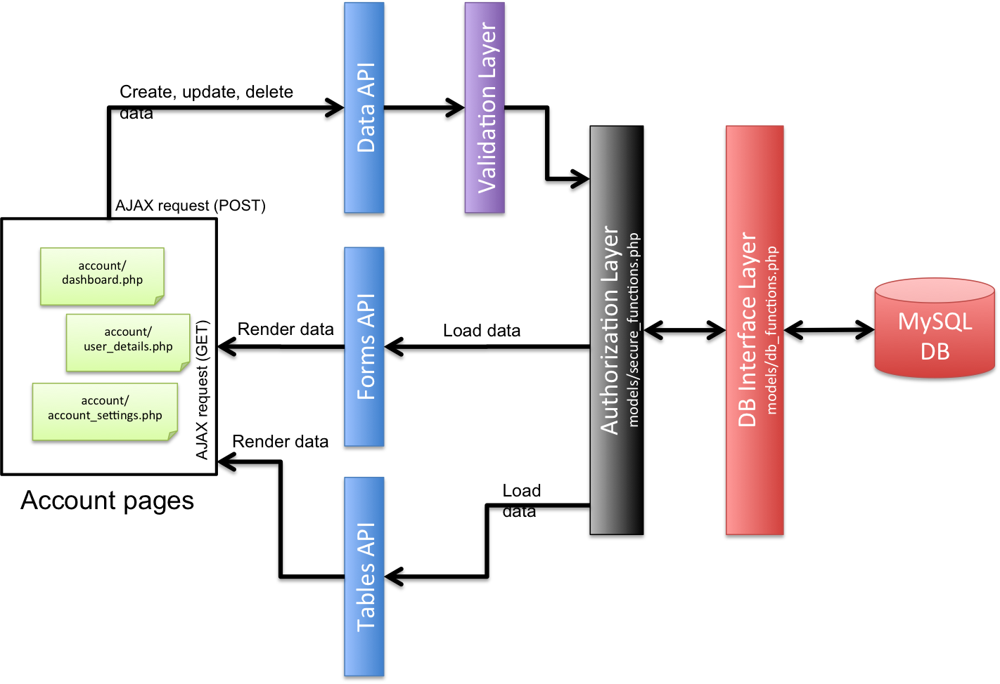

---
layout: default
title: "UserFrosting: Tutorials and Help"
---   

# Tutorials and how to get help with UserFrosting

## High-level overview of code structure

## Adding a new user field

The most common question we get is "how do I add a new user field?"  We have created a [simple tutorial on our wiki](https://github.com/alexweissman/UserFrosting/wiki/How-to-add-a-new-user-field) to help you get started.  Please note that it is only a guide to help you get started, and only covers the very basics of modifying and extending UF.  To make more advanced changes, you must take the time to read through the code to understand the different components and how they interact.

Please feel free to ask specific questions on our [Issues page](https://github.com/alexweissman/UserFrosting/issues), **after** you have spent time trying to figure it out yourself.  Also, remember that courtesy and proper grammar go a long way.  Please take the time to craft a precise, polite question.  Report any error messages you get in your PHP error log, as well as in your browser console.  We will do our best to help, but remember that this is an open source project - none of us are getting paid to develop this project, or act as your personal support hotline ;-)

If you find a problem in any of the tutorials, let us know on the Issues page.  Also, please feel free to contribute to the wiki pages if you have something relevant and useful to add.

## Adding new navigation menu items

Please see the wiki page, https://github.com/alexweissman/UserFrosting/wiki/Adding-a-navigation-menu-item.

